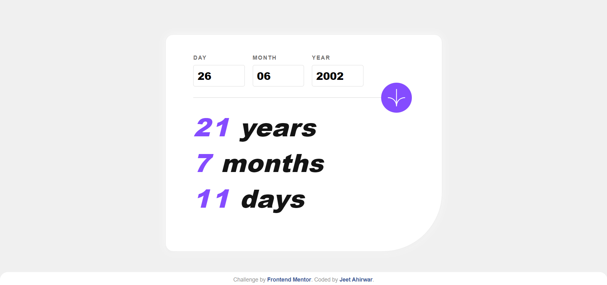

# Frontend Mentor - Age calculator app solution

This is a solution to the [Age calculator app challenge on Frontend Mentor](https://www.frontendmentor.io/challenges/age-calculator-app-dF9DFFpj-Q). Frontend Mentor challenges help you improve your coding skills by building realistic projects. 

## Table of contents

- [Overview](#overview)
  - [The challenge](#the-challenge)
  - [Screenshot](#screenshot)
  - [Links](#links)
- [My process](#my-process)
  - [Built with](#built-with)
  - [What I learned](#what-i-learned)
  - [Continued development](#continued-development)
  - [Useful resources](#useful-resources)
- [Author](#author)
- [Acknowledgments](#acknowledgments)

## Overview

### The challenge

The challenge required building an age calculator app with the following features:

- Users can view their age in years, months, and days after submitting a valid date through the form.
- Receive validation errors for various scenarios like empty fields, invalid day, month, future year, and an invalid date.
- Optimal layout for the interface depending on their device's screen size.
- Hover and focus states for all interactive elements.
- Bonus: Age numbers animate to their final number when the form is submitted.

### Screenshot

### Links

- Solution URL: [Add solution URL here](https://github.com/JEETAHIRWAR/Age-calculator-app)
- Live Site URL: [Add live site URL here](https://jeetahirwar.github.io/Age-calculator-app/)

## My process

### Built with

- Semantic HTML5 markup
- CSS custom properties
- Flexbox
- CSS Grid
- Mobile-first workflow
- JavaScript

### What I Learned

During the development of the Age Calculator app, I gained valuable insights and skills. Here are some key learnings:

1. **Form Validation:** Implementing robust form validation was a crucial aspect of this project. I learned how to validate user input for different scenarios, including empty fields and date validity.

2. **Responsive Design:** Ensuring the app looks and functions well on various devices taught me the importance of a responsive design approach. I utilized media queries and a mobile-first workflow to achieve this.

3. **CSS Flexbox and Grid:** The layout of the app was crafted using a combination of CSS Flexbox and Grid. This allowed for a clean and organized structure, making it easier to achieve the desired UI.

4. **JavaScript Date Object:** Working with the JavaScript Date object enabled me to calculate the age accurately based on the user's input. Understanding the intricacies of date calculations was a valuable aspect of this process.

5. **Error Handling:** Implementing error messages and dynamically updating the UI to reflect validation errors provided insights into effective error handling in a user-friendly manner.

6. **CSS Animation:** The bonus requirement to animate age numbers upon submission introduced me to CSS animations. I used keyframes to create a smooth and visually appealing transition.

7. **README Documentation:** Crafting a comprehensive README file is essential for project sharing. I learned to structure and present information in a clear and organized manner to help others understand and contribute to the project.

These learnings contribute to my overall growth as a developer, and I look forward to applying them in future projects.

## Continued Development

In future developments, I plan to focus on the following areas:

- **Enhanced User Experience:** Explore ways to improve the overall user experience, such as adding smooth transitions, refining the layout for different screen sizes, and optimizing performance.

- **Accessibility Improvements:** Conduct further testing and implement accessibility enhancements to ensure the app is usable for a diverse audience, including those with disabilities.

- **Additional Features:** Consider adding more features to make the age calculator app even more versatile and engaging. Ideas include saving user inputs, allowing users to compare multiple dates, or integrating with external APIs for additional functionality.

- **Code Refactoring:** Continue refining the codebase, ensuring code readability, modularity, and adherence to best practices. Look for opportunities to optimize and streamline the code for maintainability.

- **Localization:** Explore the possibility of adding multi-language support to make the app accessible to users from different language backgrounds.

These focus areas aim to improve the application's functionality, accessibility, and maintainability. Feedback and contributions from the community are always welcome to further enhance the project.

### Useful Resources

Here are some valuable resources that I found helpful during the development of this project:

- [MDN Web Docs](https://developer.mozilla.org/en-US/docs/Web) - MDN (Mozilla Developer Network) provides comprehensive documentation on web technologies, including HTML, CSS, and JavaScript.

- [W3Schools](https://www.w3schools.com/) - W3Schools is an excellent resource for learning and practicing web development. It offers tutorials, references, and examples for HTML, CSS, JavaScript, and more.

These resources were instrumental in understanding and implementing various aspects of web development. Whether you're a beginner or an experienced developer, these references can be valuable tools for improving your skills.

## Author

- [JEET AHIRWAR]
- Frontend Mentor - [@JEETAHIRWAR](https://www.frontendmentor.io/profile/JEETAHIRWAR)

## Acknowledgments

I would like to express my gratitude to the following individuals and resources for their contributions, support, and inspiration during the development of this project:

Your guidance and assistance have been invaluable, making this project a more enriching learning experience.

## Thank You!

I appreciate your time in reviewing this project. Thank you for the opportunity to showcase my skills and for any feedback you may provide.

This project was made possible thanks to the supportive community at Frontend Mentor. If you're interested in improving your skills in front-end development, I encourage you to check